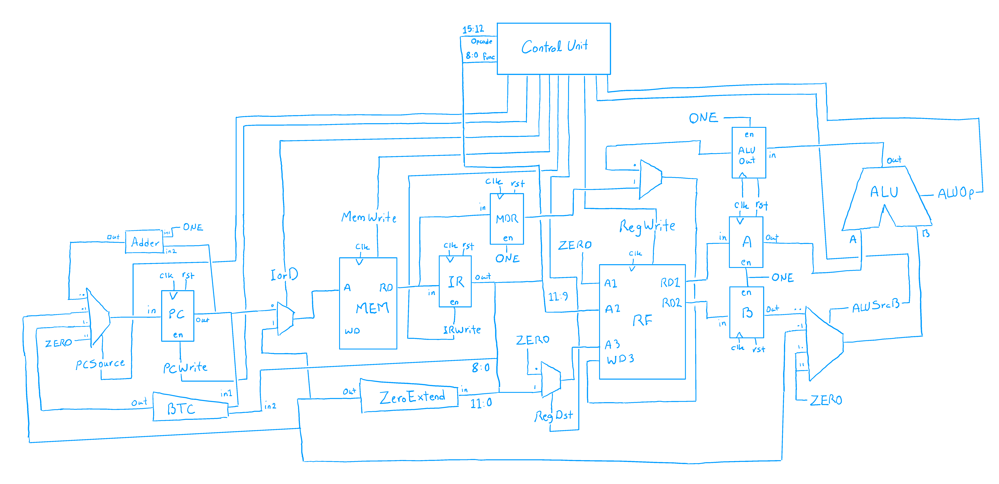

# MIPS Multi-Cycle Processor Implementation

> **Computer Architecture - University of Tehran - Department of Electrical & Computer Engineering**

  

## 📌 Overview

This repository contains the Register Transfer Level (RTL) implementation of a **Multi-Cycle MIPS Processor**. This project was developed as the *Third Assignment* for the *Computer Architecture* course at the University of Tehran.

Unlike single-cycle processors, this architecture breaks down instruction execution into multiple clock cycles, allowing for resource sharing (like a single Memory and a single ALU) and potentially higher clock frequencies.

## 🏗️ Architecture

The design follows a finite state machine (FSM) approach to manage the execution flow across different cycles: **Fetch, Decode, Execute, Memory, and Write-back**.

### 🗺️ DataPath Design

The multi-cycle datapath reduces hardware overhead by reusing key components. it includes the ALU, Register File, Program Counter (PC).


### 🎮 ControlUnit Design

The Control Unit is the brain of the multi-cycle processor, implemented as a **Finite State Machine**. It generates control signals based on the current state and the instruction opcode.

* **Main Decoder:** Manages overall control signals like `RegWrite`, `MemWrite`, etc:
  | State           | PCWrite | IRWrite | MemRead | MemWrite | IorD | RegWrite | MemtoReg | ALUSrcB | ALUOp  | RegDst | Description            |
  | ----------------| ------- | ------- | ------- | -------- | ---- | -------- | -------- | ------- | ------ | ------ | ---------------------- |
  | **FETCH**       | 1       | 1       | 1       | 0        | 0    | 0        | 0        | 0       | 0      | 0      | Instruction Fetch      |
  | **DECODE**      | 0       | 0       | 0       | 0        | 0    | 0        | 0        | 0       | 0      | 0      | Decode & Reg Read      |
  | **MEM_ADDR**    | 0       | 0       | 0       | 0        | 0    | 0        | 0        | 0       | 0      | 0      | Address Calculation    |
  | **MEM_READ**    | 0       | 0       | 1       | 0        | 1    | 0        | 0        | 0       | 0      | 0      | Memory Access (Load)   |
  | **MEM_WB**      | 0       | 0       | 0       | 0        | 0    | 1        | 1        | 0       | 0      | 0      | Write-back from Memory |
  | **MEM_WRITE**   | 0       | 0       | 0       | 1        | 1    | 0        | 0        | 0       | 0      | 0      | Memory Access (Store)  |
  | **EXEC_TYPE_C** | 0       | 0       | 0       | 0        | 0    | 0        | 0        | 0       | Func   | 0      | R-type Execution       |
  | **EXEC_TYPE_D** | 0       | 0       | 0       | 0        | 0    | 0        | 0        | 1       | Opcode | 0      | I-type Execution       |
  | **WB_ALU**      | 0       | 0       | 0       | 0        | 0    | 1        | 0        | 0       | 0      | Note A | ALU Write-back         |
  | **BRANCH**      | 1*      | 0       | 0       | 0        | 0    | 0        | 0        | 0       | 1      | 0      | Branch Completion      |
  | **JUMP**        | 1       | 0       | 0       | 0        | 0    | 0        | 0        | 0       | 0      | 0      | Jump Completion        |

* **ALU Decoder:** Determines the specific ALU operation based on `funct3` and `funct7` bits:

  R-Type Instruction Logic (Type-C)
  | Function Bit | ALUOp  | Operation       |
  | ------------ | ------ | --------------- |
  | Func[0]      | 3'b101 | Pass In1        |
  | Func[1]      | 3'b110 | Pass In2        |
  | Func[2]      | 3'b000 | Addition (+)    |
  | Func[3]      | 3'b001 | Subtraction (-) |
  | Func[4]      | 3'b010 | Bitwise AND (&) |
  | Func[5]      | 3'b011 | Bitwise OR (\|) |
  | Func[6]      | 3'b100 | Bitwise NOT (~) |

  I-Type Instruction Logic (Type-D)
  | Opcode  | ALUOp  | Operation            |
  | ------- | ------ | -------------------- |
  | 4'b1100 | 3'b000 | ADDI (Add Immediate) |
  | 4'b1101 | 3'b001 | SUBI (Sub Immediate) |
  | 4'b1110 | 3'b010 | ANDI (And Immediate) |
  | 4'b1111 | 3'b011 | ORI (Or Immediate)   |

* **Conditional Signal Logic:** Special conditions for register destinations and program counter updates:
  | Signal             | Condition                             | Value | Description           |
  | ------------------ | ------------------------------------- | ----- | --------------------- |
  | **RegDst**         | Opcode == 4'b1000 AND Func[0] == 1    | 1     | Write to IR[11:9]     |
  |                    | Otherwise                             | 0     | Write to 3'b000       |
  | **PCSource**       | current_state == JUMP                 | 2'b01 | Jump Target Address   |
  |                    | current_state == BRANCH AND Zero == 1 | 2'b10 | Branch Target Address |
  |                    | Otherwise                             | 2'b00 | PC + 1 (Default)      |

* **Multiplexer Selection Logic:** Defines how data is routed through the datapath based on control signals:
  | Mux Name            | Selection Signal | sel=0 Output   | sel=1 Output    |
  | ------------------- | ---------------- | -------------- | --------------- |
  | **AdrMux**          | IorD             | PC_Out         | IR_Address_Ext  |
  | **WDMux**           | MemtoReg         | ALU_Result_Reg | MDR_Out         |
  | **RegDstMux**       | RegDst           | 3'b000         | IR_Out[11:9]    |
  | **SrcBMux**         | ALUSrcB          | B_Out (if 00)  | Imm_Ext (if 01) |

## 📂 Repository Structure

The project is organized as follows:

```text
MIPS-Multi-Cycle-Processor-Implementation/
├── Description/           # Project requirements and documents
│   └── CA#03.pdf          # Problem statement (Assignment 3)
├── Design/                # Architecture diagrams and design docs
│   ├── DataPath.png       # Multi-cycle datapath schematic
│   ├── ControlUnit.png    # FSM and Control logic diagrams
│   ├── ALUControlLogic... # ALU decoding logic
│   ├── MuxSelection...    # Datapath multiplexer logic
│   └── Design.pdf         # Detailed project report
├── Project/               # ModelSim project files and simulation data
│   ├── CA_CA3.mpf         # ModelSim project file
│   └── program.mem        # Machine code for testing
├── Source/                # Verilog HDL source files
│   ├── TopModule.v        # Top-level entity
│   ├── Datapath.v         # Datapath interconnection
│   ├── ControlUnit.v      # Main FSM and ALU Control
│   ├── ALU.v              # Arithmetic Logic Unit
│   ├── Memory.v           # Combined Instruction/Data Memory
│   ├── RegisterFile.v     # MIPS Register File
│   ├── Register.v         # Basic flip-flop modules for state storage
│   ├── Mux.v / Adder.v    # Reusable hardware components
│   └── TestBench.v        # Testbench for verification
└── README.md              # Project documentation
```

## 👥 Contributors

This project was developed as a team effort for the **Computer Architecture** course at the **University of Tehran**.

* **[Meraj Rastegar](https://github.com/mragetsars)**
* **[Meraj Poorhosseiny](https://github.com/MerajPoorhosseiny)**
